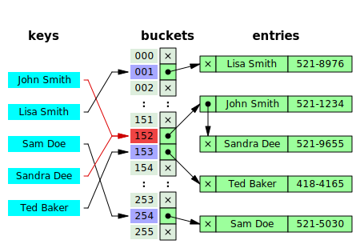

# Data Structures

## Complexity summary

- Worst case time and space complexity

| Data Structure                                                                            | Access      | Search      | Insertion   | Deletion    | Space complexity |
| ----------------------------------------------------------------------------------------- | ----------- | ----------- | ----------- | ----------- | ---------------- |
| [Array](http://en.wikipedia.org/wiki/Array_data_structure)                                | `O(1)`      | `O(n)`      | `O(n)`      | `O(n)`      | `O(n)`           |
| [Stack](<http://en.wikipedia.org/wiki/Stack_(abstract_data_type)>)                        | `O(n)`      | `O(n)`      | `O(1)`      | `O(1)`      | `O(n)`           |
| [Queue](<http://en.wikipedia.org/wiki/Queue_(abstract_data_type)>)                        | `O(n)`      | `O(n)`      | `O(1)`      | `O(1)`      | `O(n)`           |
| [Singly-Linked List](http://en.wikipedia.org/wiki/Singly_linked_list#Singly_linked_lists) | `O(n)`      | `O(n)`      | `O(1)`      | `O(1)`      | `O(n)`           |
| [Doubly-Linked List](http://en.wikipedia.org/wiki/Doubly_linked_list)                     | `O(n)`      | `O(n)`      | `O(1)`      | `O(1)`      | `O(n)`           |
| [Skip List](http://en.wikipedia.org/wiki/Skip_list)                                       | `O(n)`      | `O(n)`      | `O(n)`      | `O(n)`      | `O(n log(n))`    |
| [Hash Table](http://en.wikipedia.org/wiki/Hash_table)                                     | `N/A`       | `O(n)`      | `O(n)`      | `O(n)`      | `O(n)`           |
| [Binary Search Tree](http://en.wikipedia.org/wiki/Binary_search_tree)                     | `O(n)`      | `O(n)`      | `O(n)`      | `O(n)`      | `O(n)`           |
| [Cartesian Tree](https://en.wikipedia.org/wiki/Cartesian_tree)                            | `N/A`       | `O(n)`      | `O(n)`      | `O(n)`      | `O(n)`           |
| [B-Tree](http://en.wikipedia.org/wiki/B_tree)                                             | `O(log(n))` | `O(log(n))` | `O(log(n))` | `O(log(n))` | `O(n)`           |
| [Red-Black Tree](http://en.wikipedia.org/wiki/Red-black_tree)                             | `O(log(n))` | `O(log(n))` | `O(log(n))` | `O(log(n))` | `O(n)`           |
| [Splay Tree](https://en.wikipedia.org/wiki/Splay_tree)                                    | `N/A`       | `O(log(n))` | `O(log(n))` | `O(log(n))` | `O(n)`           |
| [AVL Tree](http://en.wikipedia.org/wiki/AVL_tree)                                         | `O(log(n))` | `O(log(n))` | `O(log(n))` | `O(log(n))` | `O(n)`           |
| [KD Tree](http://en.wikipedia.org/wiki/K-d_tree)                                          | `O(n)`      | `O(n)`      | `O(n)`      | `O(n)`      | `O(n)`           |

## Linked List

- A _Linked List_ is a linear collection of data elements, called nodes, each pointing to the next node by means of a pointer. It is a data structure consisting of a group of nodes which together represent a sequence.
- **Singly-linked list**: linked list in which each node points to the next node and the last node points to null.
- **Doubly-linked list**: linked list in which each node has two pointers, p and n, such that p points to the previous node and n points to the next node; the last node's n pointer points to null.
- **Circular-linked list**: linked list in which each node points to the next node and the last node points back to the first node.

## Stack

- A _Stack_ is a collection of elements, with two principle operations: _push_, which adds to the collection, and _pop_, which removes the most recently added element
- **Last in, first out data structure (LIFO)**: the most recently added object is the first to be removed

## Queue

- A _Queue_ is a collection of elements, supporting two principle operations: _enqueue_, which inserts an element into the queue, and _dequeue_, which removes an element from the queue
- **First in, first out data structure (FIFO)**: the oldest added object is the first to be removed

## Tree

- A _Tree_ is an undirected, connected, acyclic graph

## Binary Tree

- A _Binary Tree_ is a tree data structure in which each node has at most two children, which are referred to as the _left child_ and _right child_
- **Full Tree**: a tree in which every node has either 0 or 2 children
- **Perfect Binary Tree**: a binary tree in which all interior nodes have two children and all leave have the same depth
- **Complete Tree**: a binary tree in which every level _except possibly the last_ is full and all nodes in the last level are as far left as possible

## Binary Search Tree

- A binary search tree (BST), is a type of binary tree which maintains the property that the value in each node must be greater than or equal to any value stored in the left sub-tree, and less than or equal to any value stored in the right sub-tree

## Trie

- A trie, sometimes called a radix or prefix tree, is a kind of search tree that is used to store a dynamic set or associative array where the keys are usually Strings.
- No node in the tree stores the key associated with that node; instead, its position in the tree defines the key with which it is associated.
- All the descendants of a node have a common prefix of the String associated with that node, and the root is associated with the empty String.

Example:

A trie for keys "A", "to", "tea", "ted", "ten", "i", "in", and "inn". Note that this example does not have all the children alphabetically sorted from left to right as it should be (the root and node 't').

## Fenwick Tree

- A Fenwick tree, sometimes called a binary indexed tree, is a tree in concept, but in practice is implemented as an implicit data structure using an array.
- Given an index in the array representing a vertex, the index of a vertex's parent or child is calculated through bitwise operations on the binary representation of its index.
- Each element of the array contains the pre-calculated sum of a range of values, and by combining that sum with additional ranges encountered during an upward traversal to the root, the prefix sum is calculated.

Time Complexity:

| Operation | Complexity  |
| --------- | ----------- |
| Range Sum | `O(log(n))` |
| Update    | `O(log(n))` |

Example:

Create a binary indexed tree for the array [1, 2, 3, 4, 5] by inserting one by one.

## Segment Tree

- A Segment tree, is a tree data structure for storing intervals, or segments. It allows querying which of the stored segments contain a given point

Time Complexity:

| Operation   | Complexity  |
| ----------- | ----------- |
| Range Query | `O(log(n))` |
| Update      | `O(log(n))` |

Example:

Graphic example of the structure of the segment tree. This instance is built for the segments shown at the bottom.

## Heap

- A _Heap_ is a specialized tree based structure data structure that satisfies the _heap_ property: if A is a parent node of B, then the key (the value) of node A is ordered with respect to the key of node B with the same ordering applying across the entire heap.
- A heap can be classified further as either a "max heap" or a "min heap".
- In a max heap, the keys of parent nodes are always greater than or equal to those of the children and the highest key is in the root node.
- In a min heap, the keys of parent nodes are less than or equal to those of the children and the lowest key is in the root node

Time Complexity:

| Operation        | Complexity  |
| ---------------- | ----------- |
| Access Max / Min | `O(1)`      |
| Insert           | `O(log(n))` |
| Remove Max / Min | `O(log(n))` |

Example:

Example of a binary max-heap with node keys being integers from 1 to 100

## Hash map

- _Hashing_ is used to map data of an arbitrary size to data of a fixed size. The values returned by a hash function are called hash values, hash codes, or simply hashes. If two keys map to the same value, a collision occurs.
- **Hash Map**: a _hash map_ is a structure that can map keys to values. A hash map uses a hash function to compute an index into an array of buckets or slots, from which the desired value can be found.
- Collision Resolution:
  - **Separate Chaining**: in _separate chaining_, each bucket is independent, and contains a list of entries for each index. The time for hash map operations is the time to find the bucket (constant time), plus the time to iterate through the list
  - **Open Addressing**: in _open addressing_, when a new entry is inserted, the buckets are examined, starting with the hashed-to-slot and proceeding in some sequence, until an unoccupied slot is found. The name open addressing refers to the fact that the location of an item is not always determined by its hash value

Example:

Hash collision resolved by separate chaining.

## Graph

- A _Graph_ is an ordered pair of G = (V, E) comprising a set V of vertices or nodes together with a set E of edges or arcs, which are 2-element subsets of V (i.e. an edge is associated with two vertices, and that association takes the form of the unordered pair comprising those two vertices)
- **Undirected Graph**: a graph in which the adjacency relation is symmetric. So if there exists an edge from node u to node v (u -> v), then it is also the case that there exists an edge from node v to node u (v -> u)
- **Directed Graph**: a graph in which the adjacency relation is not symmetric. So if there exists an edge from node u to node v (u -> v), this does _not_ imply that there exists an edge from node v to node u (v -> u)

Example:

